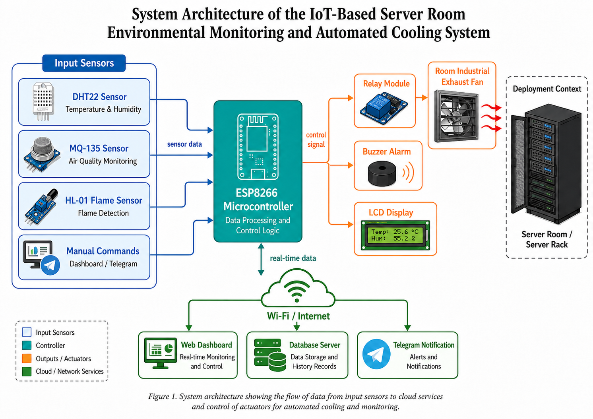
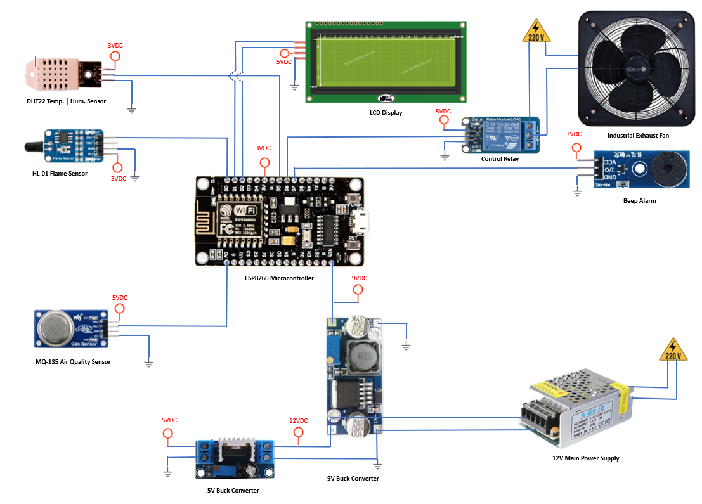
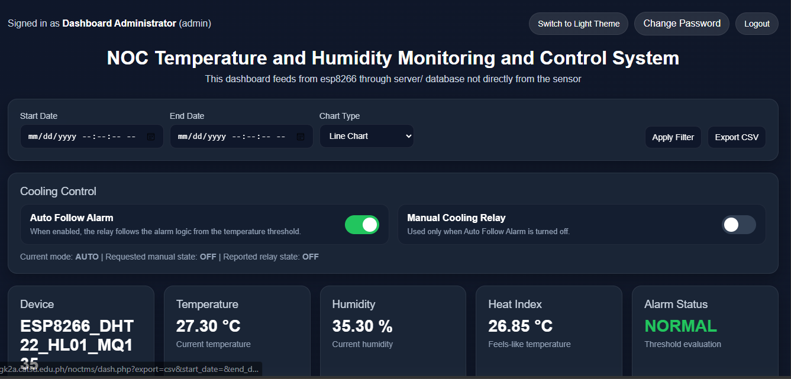
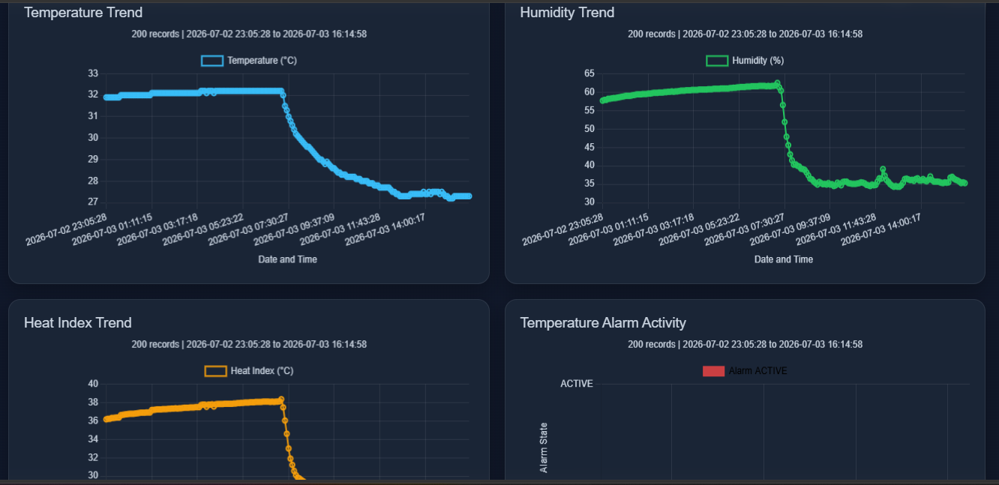

# IoT-Based Server Room Environmental Monitoring and Automated Cooling System

An IoT-based monitoring and control system designed for a server room environment. The system uses an ESP8266 microcontroller to collect temperature, humidity, air-quality, and flame-detection data, then sends the readings to a PHP/MySQL web dashboard for real-time monitoring, historical logging, alarm tracking, Telegram notifications, and automated cooling fan control.

> Developed for LOW Budget server room / NOC environment monitoring and automated cooling control.

---

## System Architecture



**Figure 1.** System architecture showing the flow of sensor data from the ESP8266 controller to the dashboard, database, Telegram notification service, and cooling actuator.

---

## Circuit Diagram



**Figure 2.** Circuit connection of the ESP8266 microcontroller, sensors, LCD display, relay module, buzzer alarm, buck converters, power supply, and industrial exhaust fan.

---

## Key Features

- Real-time temperature and humidity monitoring using a DHT22 sensor
- Air-quality monitoring using an MQ-135 sensor
- Flame detection using an HL-01 flame sensor
- Automated cooling fan control through a relay module
- Manual cooling control through the web dashboard and Telegram commands
- LCD display for local system status
- Buzzer alarm for safety warnings
- PHP-based web dashboard with login protection
- MySQL/MariaDB database logging for historical records
- Date filtering and chart visualization for sensor trends
- Telegram notifications for alerts, device status, and manual fan commands
- API key protection for ESP8266 sensor logging and cooling-control endpoints
- Session security, CSRF protection, login-attempt control, and password-change support in the dashboard

---

## Hardware Components

| Component | Purpose |
|---|---|
| ESP8266 / NodeMCU | Main microcontroller for data processing and control logic |
| DHT22 Sensor | Temperature and humidity measurement |
| MQ-135 Sensor | Air-quality / smoke-level monitoring |
| HL-01 Flame Sensor | Flame detection |
| I2C LCD Display | Local display of sensor and system status |
| Relay Module | Controls the exhaust fan switching circuit |
| Industrial Exhaust Fan | Cooling actuator for the server room |
| Buzzer Module | Audible alarm for warning and critical conditions |
| 12V Power Supply | Main system power source |
| 9V Buck Converter | Power conversion for controller-side supply requirement |
| 5V Buck Converter | Power conversion for peripheral modules |

> **Electrical safety warning:** The exhaust fan operates on high voltage. Use proper relay isolation, enclosure protection, grounding, fuse protection, and qualified supervision when connecting AC-powered loads.

---

## ESP8266 Pin Mapping

| ESP8266 Pin | Connected Device |
|---|---|
| D0 | HL-01 flame sensor digital output |
| D1 | I2C LCD SCL |
| D2 | I2C LCD SDA |
| D5 | DHT22 data pin |
| D6 | Buzzer module |
| D7 | Relay module |
| A0 | MQ-135 analog output |

---

## Software Stack

- **Microcontroller:** ESP8266 / NodeMCU
- **Firmware:** Arduino C++
- **Backend:** PHP 8+
- **Database:** MySQL or MariaDB
- **Frontend:** HTML, CSS, JavaScript, Chart.js
- **Notifications:** Telegram Bot API
- **Optional Cloud Logging:** ThingSpeak

---

## Repository Files

```text
.
|-- README.md
|-- IoT_Based_Server_Room_Environment_Monitoring_and_Data_Logger_Sy.ino
|-- config.example.h
|-- .gitignore
|-- architecture.png
|-- circuit.png
|-- dash.php
|-- log_sensor.php
|-- cooling_control_api_secure.php
|-- change_password_dashboard.php
`-- templogger.sql
```

| File | Description |
|---|---|
| `IoT_Based_Server_Room_Environment_Monitoring_and_Data_Logger_Sy.ino` | ESP8266 firmware for sensor reading, LCD updates, Telegram commands, MySQL HTTP logging, OTA, and relay control |
| `config.h` | Local private Arduino configuration used by the firmware during compile. Create this from `config.example.h` |
| `config.example.h` | Safe template for firmware keys, URLs, and feature toggles |
| `.gitignore` | Prevents local secrets such as `config.h` from being committed |
| `dash.php` | Main secured web dashboard for login, monitoring, charts, history records, and cooling control |
| `log_sensor.php` | API endpoint used by the ESP8266 to submit sensor data to the database |
| `cooling_control_api_secure.php` | API endpoint used by the ESP8266 and dashboard for cooling relay state synchronization |
| `change_password_dashboard.php` | Password-change page for dashboard users |
| `templogger.sql` | MySQL/MariaDB database dump for the project tables |
| `architecture.png` | System architecture diagram for GitHub display |
| `circuit.png` | Wiring/circuit diagram for GitHub display |

---

## Database Tables

The system uses the following main tables:

| Table | Purpose |
|---|---|
| `sensor_logs` | Stores temperature, humidity, heat index, alarm, MQ-135, smoke level, flame, and safety alarm records |
| `cooling_control` | Stores cooling mode, manual fan state, relay state, and last update time |
| `dashboard_users` | Stores dashboard login accounts and password hashes |
| `dashboard_login_attempts` | Stores login-attempt records for basic brute-force protection |

The PHP files can automatically create or migrate required tables/columns when opened or called, but importing the SQL file first is recommended.

---

## Installation Guide

### 1. Clone or Download the Repository

```bash
git clone https://github.com/DV4LQY/IoT-Based-Server-Room-Environment-Monitoring-and-Data-Logger-System.git
cd IoT-Based-Server-Room-Environment-Monitoring-and-Data-Logger-System
```


---

### 2. Set Up the Web Server

Use any PHP/MySQL local or live server environment such as:

- XAMPP
- WAMP
- Laragon
- LAMP server
- Shared hosting with PHP and MySQL support

Copy the PHP files into your web server directory, for example:

```text
htdocs/noctms/
```

Expected local access example:

```text
http://localhost/noctms/dash.php
```

---

### 3. Create the Database

Create a database using the same name configured in the PHP files.

```sql
CREATE DATABASE tempLogger CHARACTER SET utf8mb4 COLLATE utf8mb4_general_ci;
USE tempLogger;
```

Then import the SQL file:

```bash
mysql -u root -p tempLogger < templogger.sql
```

You may also import `templogger.sql` through phpMyAdmin.

> Note: The SQL dump may show `templogger`, while the PHP files use `tempLogger`. On Linux servers, database names may be case-sensitive. Use one consistent database name in the SQL database and in all PHP configuration constants.

---

### 4. Configure the PHP Files

Open these files and update the database credentials and API keys:

```text
dash.php
log_sensor.php
cooling_control_api_secure.php
change_password_dashboard.php
```

Update the following constants as needed:

```php
const DB_HOST = 'localhost';
const DB_USER = 'YOUR_DATABASE_USERNAME';
const DB_PASS = 'YOUR_DATABASE_PASSWORD';
const DB_NAME = 'tempLogger';
```

Also replace the API key constants with your own private values:

```php
const SENSOR_POST_API_KEY = 'YOUR_SENSOR_POST_API_KEY';
const CONTROL_API_KEY = 'YOUR_CONTROL_API_KEY';
```

For production deployment, also review:

```php
const FORCE_HTTPS = true;
const ALLOWED_HOSTS = ['yourdomain.com'];
```

---

### 5. Create or Reset the Dashboard Admin Account

The SQL dump may already include a sample dashboard account. For a clean installation, generate your own password hash:

```bash
php -r "echo password_hash('YourStrongPassword123!', PASSWORD_DEFAULT), PHP_EOL;"
```

Then update or insert the dashboard user in MySQL:

```sql
UPDATE dashboard_users
SET password_hash = 'PASTE_GENERATED_HASH_HERE',
    must_change_password = 0,
    last_password_change_at = NOW()
WHERE username = 'admin';
```

If no admin user exists:

```sql
INSERT INTO dashboard_users
(username, password_hash, full_name, must_change_password, last_password_change_at)
VALUES
('admin', 'PASTE_GENERATED_HASH_HERE', 'Dashboard Administrator', 0, NOW());
```

---

### 6. Configure the ESP8266 Firmware

The firmware keeps keys and URLs outside the main `.ino` file. Arduino compiles values from `config.h`, which must be in the same folder as the `.ino` file.

Create your local config files from the examples:

```bash
cp config.example.h config.h
```

On Windows PowerShell:

```powershell
Copy-Item config.example.h config.h
```

Then edit `config.h` and replace the placeholder values:

```cpp
#define CFG_WIFI_SSID "your_wifi_ssid"
#define CFG_WIFI_PASSWORD "your_wifi_password"

#define CFG_ENABLE_THINGSPEAK true
#define CFG_THINGSPEAK_CHANNEL_ID 0UL
#define CFG_THINGSPEAK_WRITE_API_KEY "your_thingspeak_write_api_key"

#define CFG_ENABLE_TELEGRAM true
#define CFG_TELEGRAM_BOT_TOKEN "your_telegram_bot_token"
#define CFG_TELEGRAM_CHAT_ID "your_telegram_chat_id"

#define CFG_ENABLE_MYSQL_HTTP true
#define CFG_MYSQL_POST_URL "http://your-server/noctms/log_sensor.php"
#define CFG_MYSQL_POST_API_KEY "your_mysql_post_api_key"

#define CFG_CONTROL_API_URL "http://your-server/noctms/cooling_control_api_secure.php"
#define CFG_CONTROL_API_KEY "your_control_api_key"
```

If ThingSpeak, Telegram, or MySQL HTTP logging will not be used, set the related `CFG_ENABLE_*` value to `false`.

The firmware includes `#include "config.h"` near the top of the sketch, so no extra include path is required when `config.h` is beside the `.ino` file.

During boot, the firmware waits until Wi-Fi is connected, has a valid IP address, and remains stable for the configured startup stability window before starting cloud/API services.

---

### 7. Compile and Upload the ESP8266 Firmware

Using Arduino IDE:

1. Open `IoT_Based_Server_Room_Environment_Monitoring_and_Data_Logger_Sy.ino`.
2. Confirm `config.h` appears as another tab in the Arduino IDE.
3. Select the correct ESP8266 board from **Tools > Board**.
4. Select the correct serial port from **Tools > Port**.
5. Click **Verify** to compile or **Upload** to flash the board.

Using Arduino CLI:

```powershell
arduino-cli compile --fqbn esp8266:esp8266:nodemcuv2 "C:\Users\MIS_4LQY_PC\OneDrive\Documents\Arduino\IoT_Based_Server_Room_Environment_Monitoring_and_Data_Logger_Sy"
```

Upload example:

```powershell
arduino-cli upload -p COM3 --fqbn esp8266:esp8266:nodemcuv2 "C:\Users\MIS_4LQY_PC\OneDrive\Documents\Arduino\IoT_Based_Server_Room_Environment_Monitoring_and_Data_Logger_Sy"
```

Use the correct board FQBN and COM port for your hardware. Common ESP8266 FQBN values include:

```text
esp8266:esp8266:nodemcuv2
esp8266:esp8266:d1_mini
esp8266:esp8266:generic
```

---

## Required Arduino Libraries

Install the following libraries in the Arduino IDE Library Manager:

- ESP8266WiFi
- ESP8266HTTPClient
- ThingSpeak
- UniversalTelegramBot
- ArduinoJson
- Wire
- LiquidCrystal_I2C
- DHT sensor library
- ArduinoOTA
- ESP8266mDNS

Also install the ESP8266 board package through Arduino IDE Board Manager.

---

## Default Firmware Thresholds

The current firmware uses these default thresholds:

| Parameter | Value |
|---|---:|
| Temperature alarm threshold | 35.0 °C |
| Temperature reset threshold | 34.5 °C |
| Humidity threshold | 55.0% |
| MQ-135 moderate raw threshold | 250 |
| MQ-135 poor raw threshold | 350 |
| MQ-135 unhealthy raw threshold | 500 |
| MQ-135 hazardous raw threshold | 700 |
| Sensor read interval | 3 seconds |
| MySQL HTTP logging interval | 5 minutes |
| Cooling-control polling interval | 5 seconds |
| Manual fan timer | 10 minutes |

These values can be adjusted directly in the firmware depending on the required server room operating condition.

---

## API Endpoints

### Sensor Logging Endpoint

```text
POST /noctms/log_sensor.php
```

Expected POST fields:

| Field | Description |
|---|---|
| `api_key` | Sensor API key |
| `device` | Device name |
| `temp_c` | Temperature in Celsius |
| `humidity` | Relative humidity percentage |
| `heat_index_c` | Computed heat index in Celsius |
| `alarm` | Temperature alarm state, `0` or `1` |
| `MQ135_raw` | MQ-135 analog value, `0` to `1023` |
| `smoke_level` | GOOD, MODERATE, POOR, UNHEALTHY, or HAZARDOUS |
| `smoke_level_value` | Numeric smoke level value |
| `flame_detected` | Flame detection state, `0` or `1` |
| `safety_alarm` | Overall safety alarm state, `0` or `1` |

Sample test request:

```bash
curl -X POST http://localhost/noctms/log_sensor.php \
  -d "api_key=YOUR_SENSOR_POST_API_KEY" \
  -d "device=ESP8266_DHT22_HL01_MQ135" \
  -d "temp_c=28.5" \
  -d "humidity=55.2" \
  -d "heat_index_c=29.1" \
  -d "alarm=0" \
  -d "MQ135_raw=220" \
  -d "smoke_level=GOOD" \
  -d "smoke_level_value=0" \
  -d "flame_detected=0" \
  -d "safety_alarm=0"
```

---

### Cooling Control Endpoint

```text
GET  /noctms/cooling_control_api_secure.php?api_key=YOUR_CONTROL_API_KEY
POST /noctms/cooling_control_api_secure.php
```

For POST requests, send:

| Field | Description |
|---|---|
| `api_key` | Cooling-control API key |
| `relay_state` | Relay state, `0` or `1` |

Sample test request:

```bash
curl -X POST http://localhost/noctms/cooling_control_api_secure.php \
  -d "api_key=YOUR_CONTROL_API_KEY" \
  -d "relay_state=1"
```

Expected JSON response:

```json
{
  "ok": true,
  "mode": "AUTO",
  "manual_state": 0,
  "relay_state": 1,
  "updated_at": "YYYY-MM-DD HH:MM:SS"
}
```

---

## Telegram Bot Commands

When Telegram is enabled in the firmware, the bot supports the following commands:

| Command | Function |
|---|---|
| `/start` or `/help` | Shows the command list |
| `/status` | Shows full system status |
| `/cloud` | Shows Wi-Fi/API/cloud status |
| `/cooling` | Shows cooling mode and relay status |
| `/fan_on` | Forces the fan ON for 10 minutes and locks AUTO mode |
| `/fan_off` | Forces the fan OFF and locks AUTO mode |
| `/fan_status` | Shows fan status and timer information |
| `/auto` | Restores automatic cooling mode |
| `/reset` or `/reboot` | Restarts the ESP8266 device |

---

## Dashboard Functions

The web dashboard provides:

- Login-protected access
- Latest temperature, humidity, heat index, MQ-135, flame, and safety-alarm values
- Cooling mode and relay status
- Manual fan control
- Automatic cooling based on threshold conditions
- Chart visualization of sensor history
- Date filtering for selected records
- Sensor log table
- CSV export support
- Password-change support

---

## Important Security Notes Before Public Upload

Before pushing to a public GitHub repository:

1. Keep `config.h` private. It is listed in `.gitignore`.
2. Commit only `config.example.h` with placeholder values.
3. Remove real Wi-Fi passwords, database passwords, API keys, Telegram bot tokens, and ThingSpeak keys from any public files.
4. Replace all public example secret values with placeholders such as `YOUR_API_KEY_HERE`.
5. Do not publish production database dumps containing real usernames, password hashes, IP addresses, or sensor records.
6. Enable HTTPS for live deployment.
7. Use a restricted database user instead of the MySQL root account.
8. Set `ALLOWED_HOSTS` when deployed to a real domain.
9. Change the default admin password immediately after installation.

---

## Suggested Future Improvements

- Add a small setup script that creates `config.h` from `config.example.h`
- Add role-based user access for dashboard users
- Add email/SMS alerting as an alternative to Telegram
- Add automatic database backup
- Add fan runtime logs and maintenance reports
- Add multi-device support for multiple server rooms
- Add enclosure temperature calibration settings
- Add real-time WebSocket updates instead of periodic polling

---

## Project Status

This project is functional as a prototype/server-room monitoring system using ESP8266, PHP, MySQL, Telegram, and relay-based cooling control. It is suitable for academic demonstration, local deployment, and further enhancement for production use.

---

## Author

**DV4LQY**

---

## 📊 Dashboard Interface

The system includes a real-time web dashboard for monitoring server room conditions and controlling cooling systems.



Key features shown in the dashboard:
- Real-time temperature and humidity monitoring
- Heat index computation
- Relay-based cooling control (Auto / Manual mode)
- Data filtering by date range
- CSV export for logging and analysis
- Alarm status indicator (NORMAL / ALERT)


## 📈 Analytics Overview

The system also provides real-time environmental trend analytics for decision-making and monitoring.



Key analytics shown:
- Temperature trend over time (°C)
- Humidity trend over time (%)
- Heat index computation
- Alarm activity tracking and visualization
- Historical record analysis (200+ logs)

These charts help identify cooling efficiency, environmental stability, and anomaly detection patterns in the server room.

## 🎓 Academic Use & Deployment

This project is intended for academic, research, and educational purposes. It demonstrates an IoT-based environmental monitoring and automated cooling system designed for server room applications.

The system has been implemented and evaluated at Catanduanes State University – ICTU_NOC (Network Operations Center) and has been used as part of personally funded research study.
